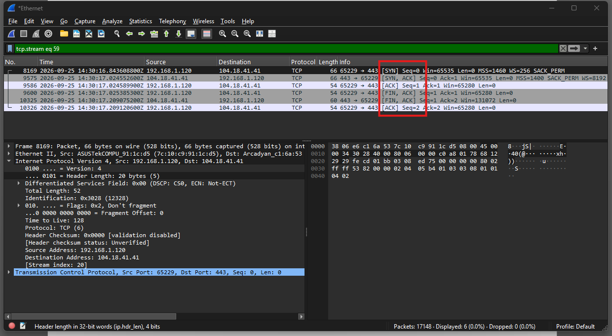

# Wireshark: TCP Handshake & Connection Termination Lab

## Overview

This lab demonstrates how to use **Wireshark** to capture network traffic generated by a Windows PC and identify:

- A TCP three-way handshake used to establish a connection
- A TCP conversation using **Follow TCP Stream**
- TCP connection termination using FIN/ACK packets
- Why a TCP "four-way handshake" may appear as three packets when ACK flags are combined with FIN flags

The purpose of this exercise is to build practical Wireshark skills and understand the TCP connection lifecycle.

---

## Lab Objectives

1. Start capturing network traffic.
2. Visit several websites to generate traffic.
3. Find a TCP three-way handshake.
4. Follow the TCP conversation.
5. Find TCP four-way termination.
6. Understand why a perfect four-packet termination sequence may not always appear.

---

# 1. Start Capturing

### Step 1 — Open Wireshark

Launch Wireshark on Windows.

### Step 2 — Select the active network interface

From the Wireshark home screen, identify the interface currently being used:

- **Wi-Fi** if connected wirelessly
- **Ethernet** if connected using a network cable

Double-click the active interface to begin capturing packets.

Packets should begin appearing in the packet list.

### Step 3 — Generate network traffic

Leave Wireshark running while browsing the Internet.

> **Tip:** Windows and other applications generate background traffic automatically, so it is normal to see many packets immediately after starting the capture.

---

# 2. Visit Some Websites

While Wireshark is capturing, open a web browser and visit several websites.

Example sites used during this exercise:

- https://www.wireshark.org
- https://github.com
- https://www.wikipedia.org

Browse for a short period to generate TCP connections.

After approximately 20–30 seconds, return to Wireshark.

### Stop the capture

Click the **red square Stop button** in Wireshark.

The captured packets can now be analyzed.

---

# 3. Find a TCP Three-Way Handshake

TCP establishes a connection using three basic steps:

```text
Client                         Server
  |                              |
  | -------- SYN --------------> |
  | <------ SYN, ACK ----------- |
  | -------- ACK --------------> |
  |                              |
       Connection Established
```

### Display filter

Use the following Wireshark display filter:

```text
tcp.flags.syn == 1
```

For a cleaner view of the initial SYN packets:

```text
tcp.flags.syn == 1 && tcp.flags.ack == 0
```

### What to look for

Find a sequence similar to:

```text
[SYN]
[SYN, ACK]
[ACK]
```

The three packets represent:

1. **SYN** — The client requests a TCP connection.
2. **SYN, ACK** — The server acknowledges the request and sends its own SYN.
3. **ACK** — The client acknowledges the server.

The TCP connection is then established.

### Example from this lab

The captured TCP connection was:

```text
Client:  192.168.1.120:65229
Server:  104.18.41.41:443
```

The observed sequence was:

```text
192.168.1.120 → 104.18.41.41   [SYN]
104.18.41.41 → 192.168.1.120   [SYN, ACK]
192.168.1.120 → 104.18.41.41   [ACK]
```

This confirms a TCP three-way handshake.

---

# 4. Follow the TCP Conversation

Wireshark provides **Follow TCP Stream**, which allows the packets belonging to a particular TCP conversation to be isolated.

### Steps

1. Select a TCP packet belonging to the connection.
2. Right-click the packet.
3. Select:

**Follow → TCP Stream**

Wireshark will apply a filter for the selected TCP stream.

You may see a filter similar to:

```text
tcp.stream eq 59
```

The stream number can be different for every capture.

### Why Follow TCP Stream is useful

It allows you to focus on the communication between two endpoints instead of analyzing unrelated packets in the capture.

For SOC and network-analysis work, this is useful when investigating:

- Client/server communication
- Suspicious connections
- Application traffic
- TCP sessions
- Potential network incidents

---

# 5. Find the TCP Four-Way Termination

TCP normally uses FIN and ACK exchanges to terminate a connection.

A conceptual four-step termination is:

```text
Client                         Server
  |                              |
  | -------- FIN --------------> |
  | <--------- ACK ------------- |
  | <--------- FIN ------------- |
  | -------- ACK --------------> |
  |                              |
       Connection Terminated
```

### Display filter

Use:

```text
tcp.flags.fin == 1
```

This displays packets containing the TCP FIN flag.

### Example from this lab

The same TCP stream showed:

```text
192.168.1.120 → 104.18.41.41   [FIN, ACK]
104.18.41.41 → 192.168.1.120   [FIN, ACK]
192.168.1.120 → 104.18.41.41   [ACK]
```

This represents the TCP connection termination.

---

# 6. Important: You Might NOT Find a Perfect Four-Way Handshake

A common beginner expectation is to find exactly:

```text
FIN
ACK
FIN
ACK
```

as four separate packets.

However, TCP flags can be combined in a single packet.

For example, Wireshark may show:

```text
[FIN, ACK]
[FIN, ACK]
[ACK]
```

instead of four separate packets.

This does **not** necessarily mean the TCP termination is incorrect.

In the capture used for this lab, the termination appeared as:

```text
FIN + ACK
FIN + ACK
ACK
```

The ACK flag is combined with the FIN flag in the relevant packets, so the four logical termination actions are represented by three packets.

### Key point

**TCP four-way termination describes the four logical steps, not necessarily four individual packets.**

Actual captures can vary because of:

- Combined TCP flags
- TCP implementation behavior
- Connection reuse
- Browser behavior
- HTTP/2 persistent connections
- TLS
- TCP resets
- Retransmissions
- Network conditions

Therefore, don't assume every capture will contain a perfect:

```text
FIN → ACK → FIN → ACK
```

sequence.

---

# Screenshot

The screenshot below shows the TCP stream captured during this exercise.

It demonstrates:

- TCP SYN
- TCP SYN/ACK
- TCP ACK
- TCP FIN/ACK
- TCP FIN/ACK
- Final TCP ACK
- Source and destination IP addresses
- TCP source/destination ports
- Wireshark's `tcp.stream` filter



---

# Useful Wireshark Filters

### Show SYN packets

```text
tcp.flags.syn == 1
```

### Show initial SYN packets

```text
tcp.flags.syn == 1 && tcp.flags.ack == 0
```

### Show FIN packets

```text
tcp.flags.fin == 1
```

### Show a specific TCP stream

```text
tcp.stream eq 59
```

Replace `59` with the TCP stream number from your own capture.

### Show TCP traffic involving a specific IP

```text
ip.addr == 192.168.1.120
```

---

# What I Learned

This exercise demonstrated how Wireshark can be used to:

- Capture live network traffic.
- Identify TCP connections.
- Analyze the TCP three-way handshake.
- Identify SYN, SYN/ACK and ACK flags.
- Follow a TCP conversation.
- Identify TCP connection termination.
- Analyze FIN and ACK flags.
- Understand why real-world packet captures may differ from simplified TCP diagrams.

These are fundamental skills for network troubleshooting, packet analysis and SOC investigations.

---

## Reference

Wireshark User's Guide:

https://www.wireshark.org/docs/wsug_html_chunked/

Npcap documentation:

https://npcap.com/guide/npcap-users-guide.html
